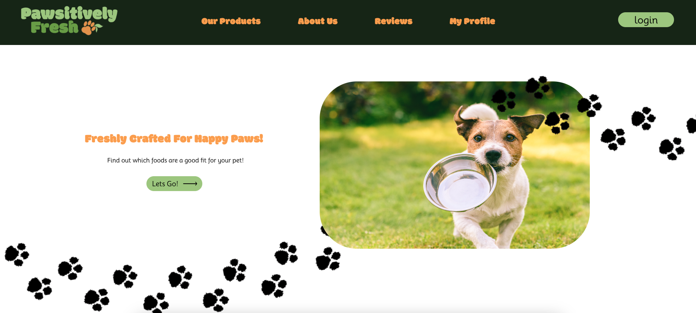
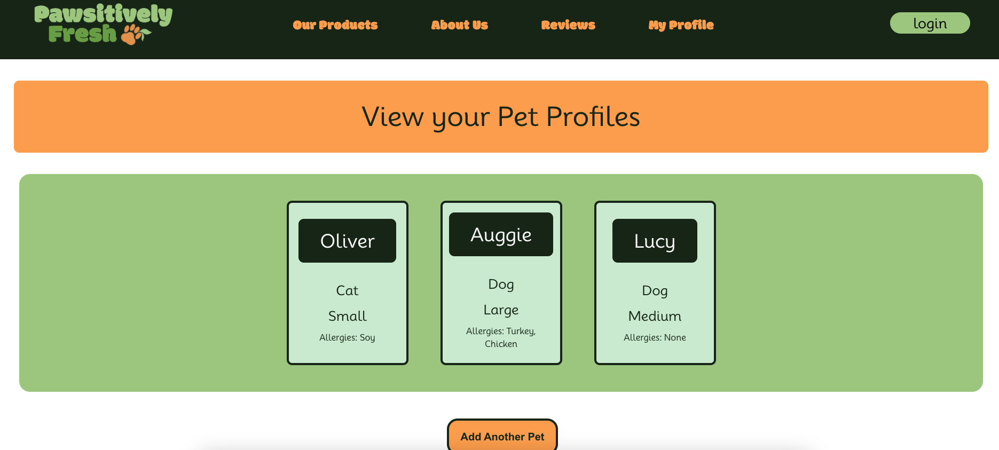

# Pawsitivley Fresh 	  

## Table Of Contents
- [Description](#description)
- [Installation](#installation)
- [Usage](#usage)
- [Contributing](#contributing)
- [Visuals/Links](#visualslinks)
- [License](#license)
- [Tests](#tests)
- [Questions](#questions)

# Description
An e-commerce site for pet food, supplies, and accessories. 

# Installation
Visit #### to view the store and purchase products for your pets.

To set up the project locally, first clone the repository and navigate to the project directory. Then, install both server and client dependencies by running 'npm install'. After installing the dependencies, create a .env file in the server directory with the necessary environment variables, including your MongoDB connection string (MONGODB_URI) and the port (PORT=3001). Optionally, you can seed the database by running npm run seed to populate the app with preloaded data. Finally, start the application using npm run develop, which will run both the server and client concurrently. Once the app is running, you can visit http://localhost:3000 to view the store and explore pet products.

# Usage
Once the application is running, users can visit the homepage to browse a variety of pet products, including both dog and cat food options. The site allows users to:

### Browse Products: 
View detailed descriptions of each product, including price, ingredients, and whether it's suitable for dogs or cats.
### Responsive Design: 
The website is fully responsive, making it accessible and easy to use on both desktop and mobile devices.
### Sign Up / Log In: 
Create an account or log in to start adding pets to your profile. This will allow you to manage your pets' preferences, allergies, and favorite products.
### Pet Profile Management: 
Add details about your pets, including their species, size, and any allergies they may have, to tailor product recommendations.
### Shopping Cart & Checkout: 
Add products to your cart, review them, and proceed to checkout to complete your purchase.

### Visit the live site at [Live URL] to start shopping for your pets today!

# Contributing
### Erin DeVine 
[GitHub Profile](https://github.com/erindevine0229)
### Nevah Evans
[GitHub Profile](https://github.com/nevah-evans)
### Selena Pixton
[GitHub Profile](https://github.com/selenapix)
### Samuel Wlodawski
[GitHub Profile](https://github.com/swlodawski)
### Stephan Kwapis
[GitHub Profile](https://github.com/sdkwapis)

An enormous thank you to Jung and all of the TAs, whose invaluable guidance and support made this project possible. This would not have been achievable without your assistance.

# Visuals/Links

### URLhere

# License
MIT

# Tests
Lot's and lot's of console logging, testing queries, and breaking things until it worked.

# Questions
For questions or comments please reach out to us at: group4awesomeproject3@gmail.com